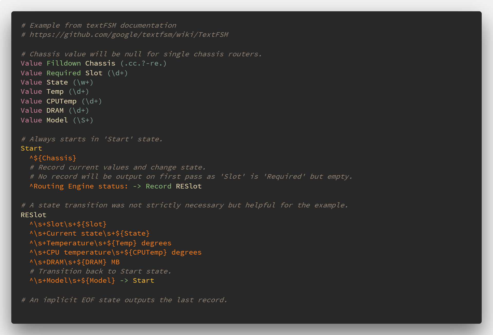

# vscode-textFSM-syntax

Visual Studio Code syntax highlighting for textFSM templates

### Syntax Coloring for:

* Comments
* Value Definitions (w/ options, regex)
* Reserved States
* States
* State Rules
* Rule Actions
* New State Transitions
* Error Actions
* EOF marker

